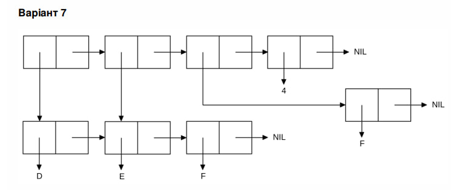

<p align="center"><b>МОНУ НТУУ КПІ ім. Ігоря Сікорського ФПМ СПіСКС</b></p>
<p align="center">
<b>Звіт з лабораторної роботи 1</b><br/>
"Обробка списків з використанням базових функцій"<br/>
дисципліни "Вступ до функціонального програмування"
</p>
<p align="right">Студентка: Нестерук Анастасія Олександрівна група КВ-11<p>
<p align="right">Рік: 2024<p>
	
## Загальне завдання
1.	Створіть список з п'яти елементів, використовуючи функції LIST і CONS . Форма створення списку має бути одна — використання SET чи SETQ (або інших допоміжних форм) для збереження проміжних значень не допускається. Загальна кількість елементів (включно з підсписками та їх елементами) не має перевищувати 10-12 шт. (дуже великий список робити не потрібно). Збережіть створений список у якусь змінну з SET або SETQ . Список має містити (напряму або у підсписках):
•	хоча б один символ
•	хоча б одне число
•	хоча б один не пустий підсписок
•	хоча б один пустий підсписок
2.	Отримайте голову списку.
3.	Отримайте хвіст списку.
4.	Отримайте третій елемент списку.
5.	Отримайте останній елемент списку.
6.	Використайте предикати ATOM та LISTP на різних елементах списку (по 2-3 приклади для кожної функції).
7.	Використайте на елементах списку 2-3 інших предикати з розглянутих у розділі 4 навчального посібника.
8.	Об'єднайте створений список з одним із його непустих підсписків. Для цього використайте функцію APPEND.

```lisp
; 1
CL-USER> (defvar first-task nil)
   (setq first-task (cons 'A
		(cons (list 'B (list 'c 'd) ()) (list 7 (list 'c 'd)))))
(print first-task)

;(A (B (C D) NIL) 7 (C D))

; 2
CL-USER> (car first-task)
; A

; 3
CL-USER> (cdr first-task)
; ((B (C D) NIL) 7 (C D))

; 4
CL-USER> (third first-task)
; 7

; 5
CL-USER> (print (car (last first-task)))
; (C D)

; 6.1.1
CL-USER> (atom (nth 1 first-task))
; NIL

; 6.1.2
CL-USER> (atom (cdr first-task))
; NIL

; 6.1.3
CL-USER> (atom (car (nthcdr 2 first-task)))
; T

; 6.2.1
CL-USER> (listp (second (nth 1 first-task)))
; T

; 6.2.2
CL-USER> (listp (first first-task))
; NIL

; 6.2.3
CL-USER> (listp (third (cdr first-task)))
; T

; 7.1.1
CL-USER> (eql (third first-task) 7)
; T

; 7.1.2
CL-USER>  (eql (cdr first-task) '('C 'D))
; NIL

; 7.2.1
CL-USER> (equal (car first-task) 'A)
; T

; 7.2.2
CL-USER> (equal (second (nth 1 first-task)) (first (last first-task)))
; T

; 7.3.1
CL-USER> (equalp (third first-task) 7.0)
; T

; 7.3.2
CL-USER>  (equalp (car first-task) 'a)
; T


; 8
CL-USER> (append first-task (second first-task))
; (A (B (C D) NIL) 7 (C D) B (C D) NIL)

```
## Варіант 7
<p align="center">

</p>

```lisp
; 15mod8 = 7
CL-USER> (defvar sub-list nil)
CL-USER> (defvar main-list nil)
CL-USER> (setq sub-list '( D E F)
		 main-list (list sub-list (cdr sub-list) '(F) 4))
CL-USER> (print main-list)

; ((D E F) (E F) (F) 4) 

```
 
